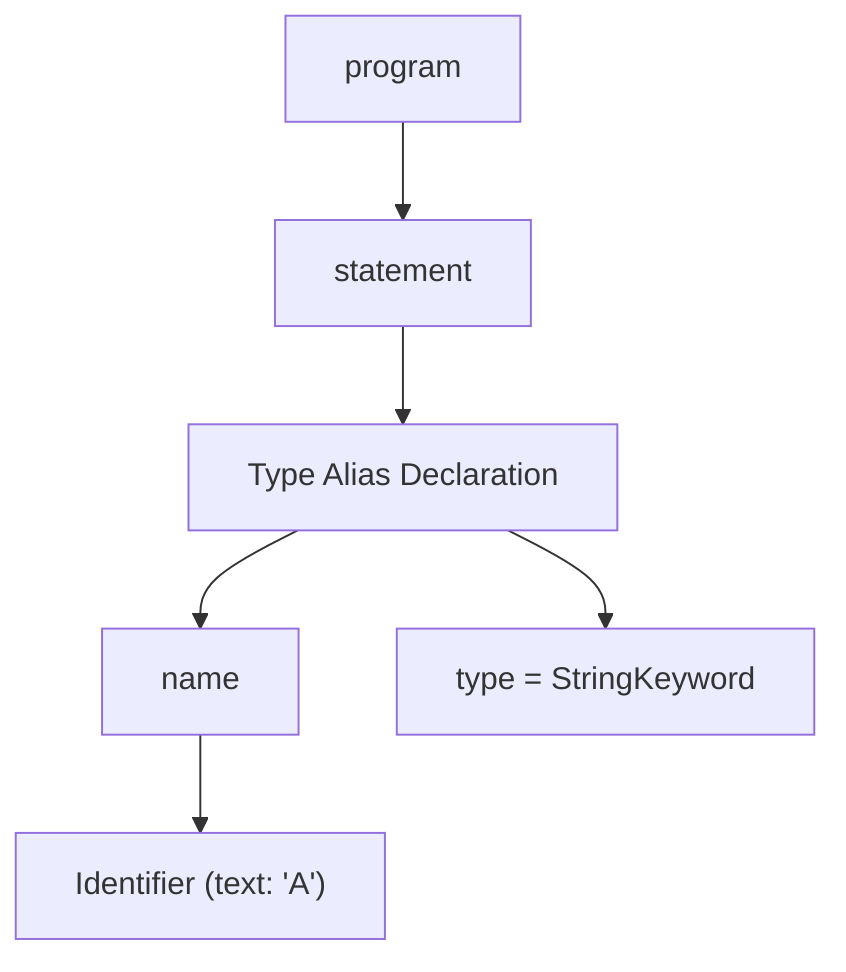
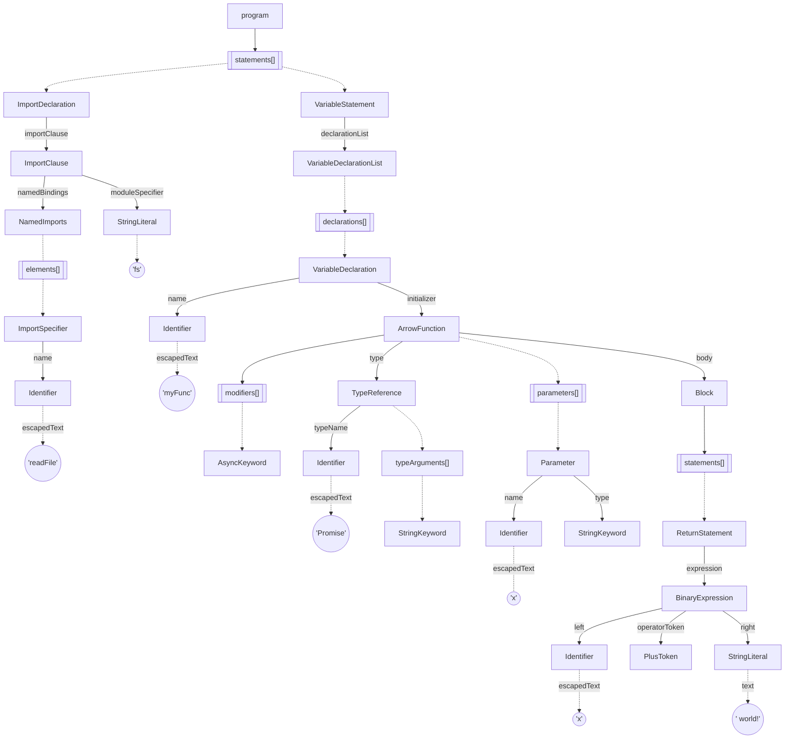

```Typescript
type A = string;
```




```TypeScript
import { readFile } from "fs";
const myFunc = async (x: string): Promise<string> => {
  return x + ' world!';
};
```



```TypeScript
const seo_landing_page = z.object({
  title: z.string(),
  url: z.string(),
  headline: z.string(),
  modular_blocks: z.array(
    z.union([
      z.object({ headline: headline }),
      z.object({ triple_block: triple_block }),
      z.object({ video: video_full_bleed_hero }),
    ]),
  ),
  ```

```JavaScript
const exp = ts.factory.createCallExpression(
  ts.factory.createIdentifier('alert'),
  undefined,
  [ts.factory.createStringLiteral('Hello World!')],
);
```

```TypeScript
alert('Hello World');
```
